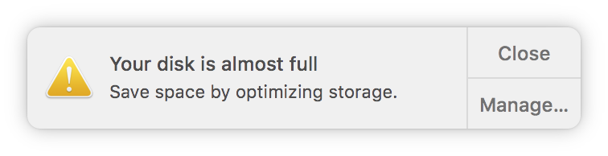

# Delete all node_modules folders recursively on Mac

DO you get notice like this?


Easly to remove all node_modules on current directory recursively.


## Step 1
```bash
wget  https://github.com/dankerizer/bersihkan.sh/raw/master/bersihkan.sh --output-document=bersihkan.sh

mv bersihkan.sh /usr/local/sbin
```

## REMEMBER
Don't run this script on global, because this script could remove all file that named with "node_modules"

So, go to your development folder. for example i use MAMP, so i open htdocs folder 
```
cd /Applications/MAMP/htdocs
```
and than...

## Run
```bash
bersihkan.sh
```

And then, if you will edit your project, you can install all node modules again
```bash
npm install
```
